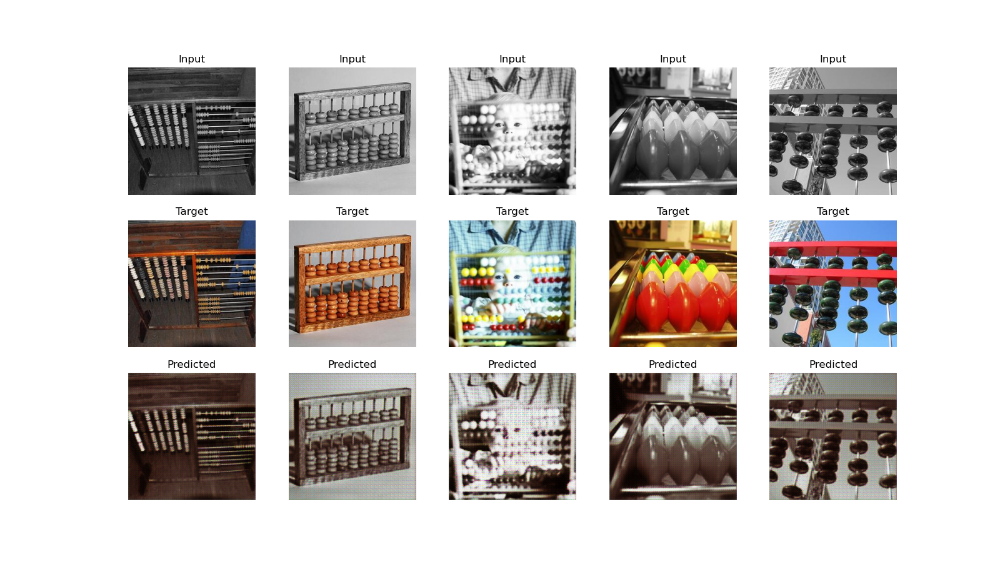
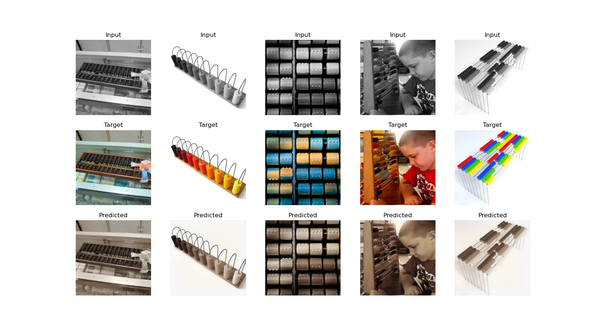
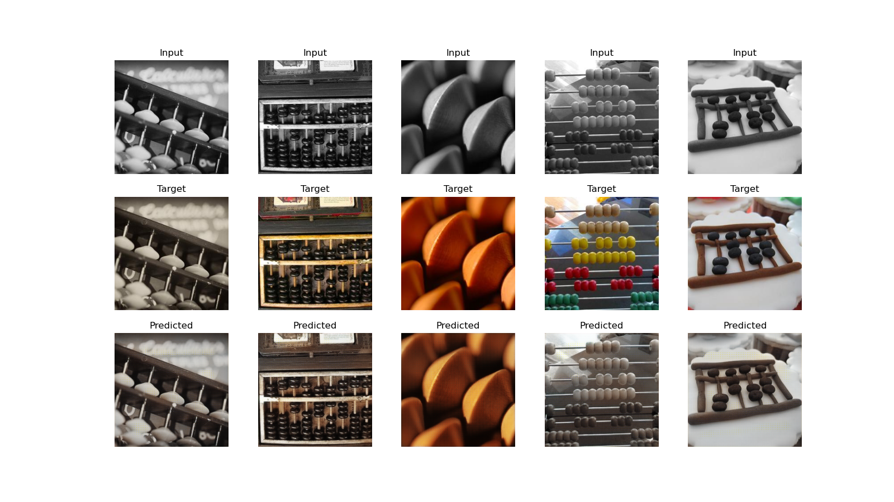
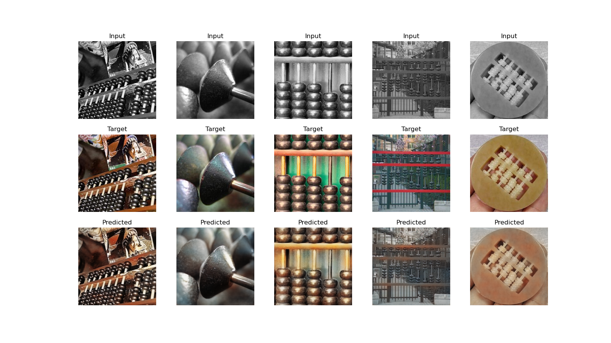
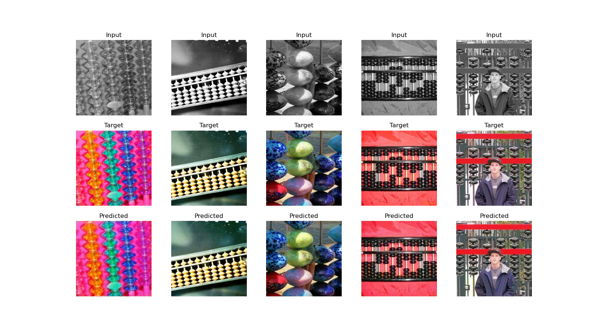
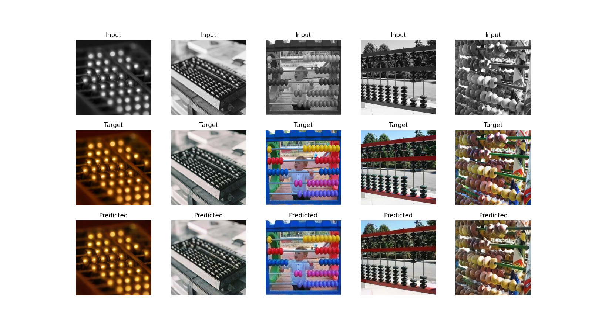

# Pix2Pix: Grayscale to Color Image Conversion

This repository contains an implementation of the Pix2Pix model, designed to convert grayscale images into color. The model was trained on a subset of ImageNet, specifically for the image colorization task. Pix2Pix, based on a conditional GAN framework, learns to map grayscale input images to colorized outputs, utilizing a U-Net-style generator and a PatchGAN discriminator.

### Results:
- **Epoch 1:** Initial output shows minimal colorization with basic color patterns. The model is still learning and produces blurry, low-quality results.  
  
  
- **Epoch 20:** The edges are distinct, with improved shapes and structures, but the outputs still lack realism and precision in color placement.  
  
  
- **Epoch 40:** The outputs are clearer, with improved boundary definition and a bit accurate color distribution. Some oversaturation and minor inaccuracies remain.  
  
  
- **Epoch 71:** Colors and structures become more natural and realistic. The model generates sharper, more detailed images with fewer artifacts.  
  
  
- **Epoch 217:** Highly realistic colorization with sharp details and smooth transitions.  
  
  
- **Epoch 218:** Slight improvements in color balance, with the model achieving near-perfect colorization.  
  

### How to Run:
1. Clone the repository:
   ```bash
   git clone https://github.com/Ganesh2609/Pix2Pix.git
   cd Pix2Pix
   ```

2. Install dependencies by setting up the environment.

3. Open the `testing_models.ipynb` notebook and run the cells to view model outputs and results.