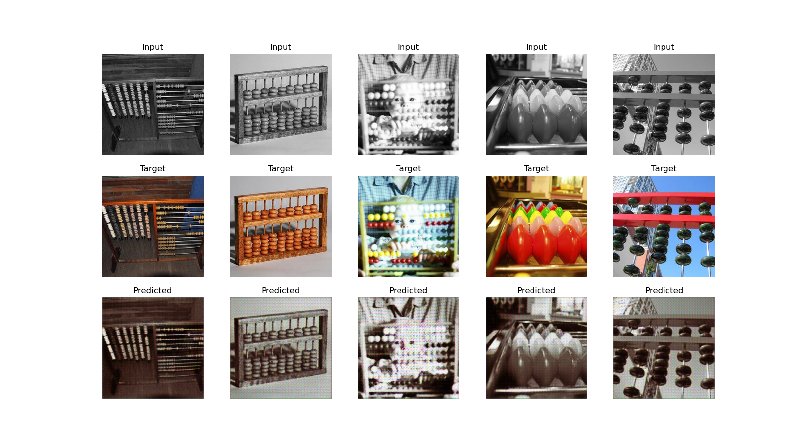
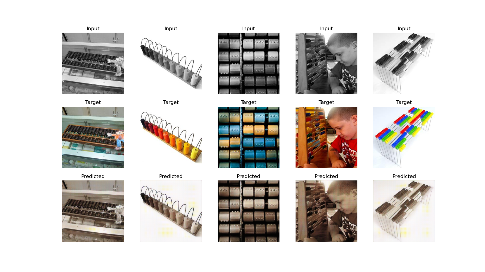
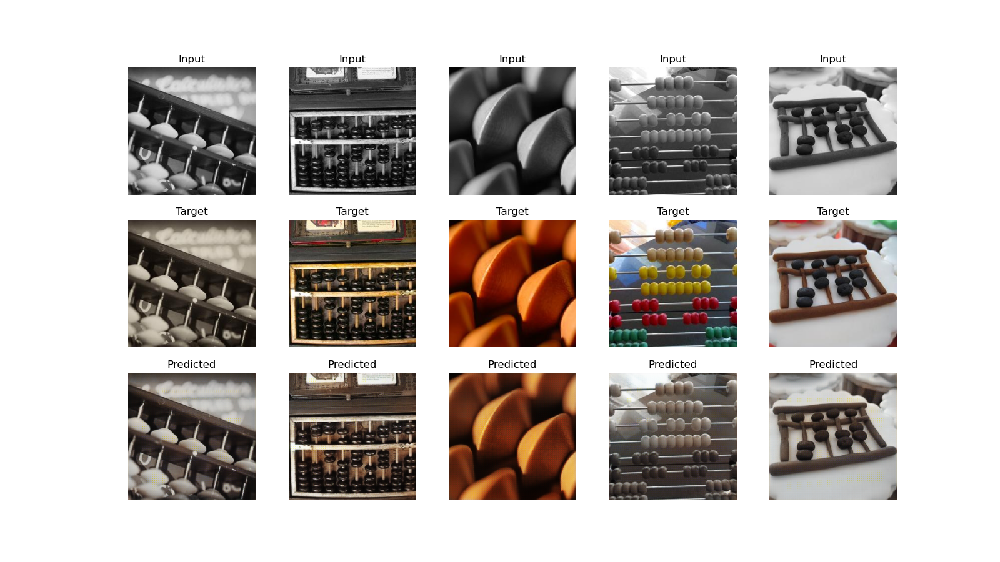
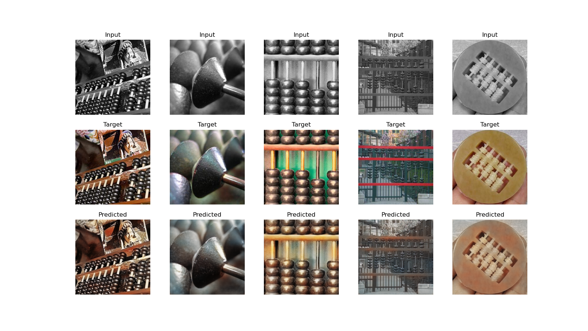
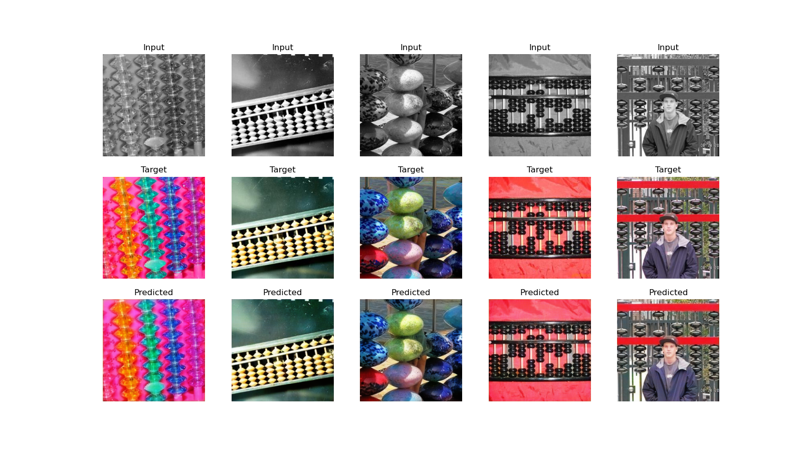
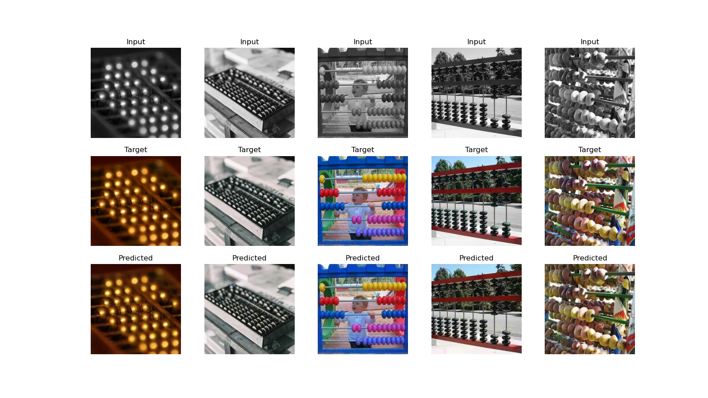

# Pix2Pix: Grayscale to Color Image Conversion

A PyTorch implementation of the Pix2Pix Conditional GAN for automatic grayscale image colorization. This model transforms black and white images into realistic color versions using adversarial training with a U-Net generator and PatchGAN discriminator.

## Theory

Pix2Pix is a conditional Generative Adversarial Network (cGAN) that learns image-to-image translation tasks. The architecture consists of:

- **Generator**: U-Net-based architecture with encoder-decoder structure and skip connections
- **Discriminator**: PatchGAN that classifies image patches as real or fake
- **Loss Function**: Combination of adversarial loss and L1 reconstruction loss (λ=100)

The model uses adversarial training where the generator learns to fool the discriminator while the discriminator learns to distinguish between real and generated images.

## Architecture

### Generator (U-Net)
- **Encoder**: Series of convolutional layers with downsampling
- **Bottleneck**: Feature compression layer
- **Decoder**: Transposed convolutions with skip connections from encoder
- **Input**: 1-channel grayscale images
- **Output**: 3-channel RGB images

### Discriminator (PatchGAN)
- **Input**: Concatenated grayscale and color images (4 channels)
- **Architecture**: Convolutional layers with LeakyReLU activation
- **Output**: Patch-wise classification scores

## Results

The model shows progressive improvement across training epochs:

**Epoch 1:** Initial colorization with basic patterns and blurry outputs


**Epoch 20:** Improved edge definition and structure recognition


**Epoch 40:** Better color distribution with some oversaturation


**Epoch 71:** More natural colors and realistic structures


**Epoch 217:** High-quality colorization with sharp details and smooth transitions


**Epoch 218:** Near-perfect colorization with excellent color balance


## Installation

1. Clone the repository:
```bash
git clone https://github.com/Ganesh2609/Pix2Pix.git
cd Pix2Pix
```

2. Install required dependencies:
```bash
pip install torch torchvision matplotlib tqdm pillow
```

## Usage

### Training
Run the training notebook to train the model:
```bash
jupyter notebook training_models.ipynb
```

### Testing
Use the testing notebook to evaluate model performance:
```bash
jupyter notebook testing_models.ipynb
```

## Model Architecture Details

**Generator Features:**
- Input channels: 1 (grayscale)
- Output channels: 3 (RGB)
- Feature maps: [64, 128, 256, 512, 512, 512, 512]
- Activation: ReLU (encoder), LeakyReLU (decoder)
- Dropout applied in first 3 decoder layers

**Discriminator Features:**
- Input channels: 4 (grayscale + RGB)
- Feature maps: [63, 128, 256, 512]
- Activation: LeakyReLU
- Output: Single channel probability map

## Training Configuration

- **Learning Rate**: 2e-4 (both generator and discriminator)
- **Batch Size**: 5
- **Optimizer**: Adam (β1=0.5, β2=0.999)
- **Loss**: BCE + L1 (λ=100)
- **Training**: Mixed precision with gradient scaling

## File Structure

```
Pix2Pix/
├── generator.py          # U-Net generator implementation
├── discriminator.py      # PatchGAN discriminator implementation
├── data.py              # Dataset class for ImageNet
├── trainer.py           # Training functions
├── training_models.ipynb # Training notebook
├── testing_models.ipynb  # Testing notebook
├── Models/              # Saved model weights
│   ├── abacus_generator.pth
│   └── abacus_discriminator.pth
└── Results/             # Training progress images
    ├── Epoch_1.png
    ├── Epoch_20.png
    ├── Epoch_40.png
    ├── Epoch_71.png
    ├── Epoch_217.png
    └── Epoch_218.png
```
